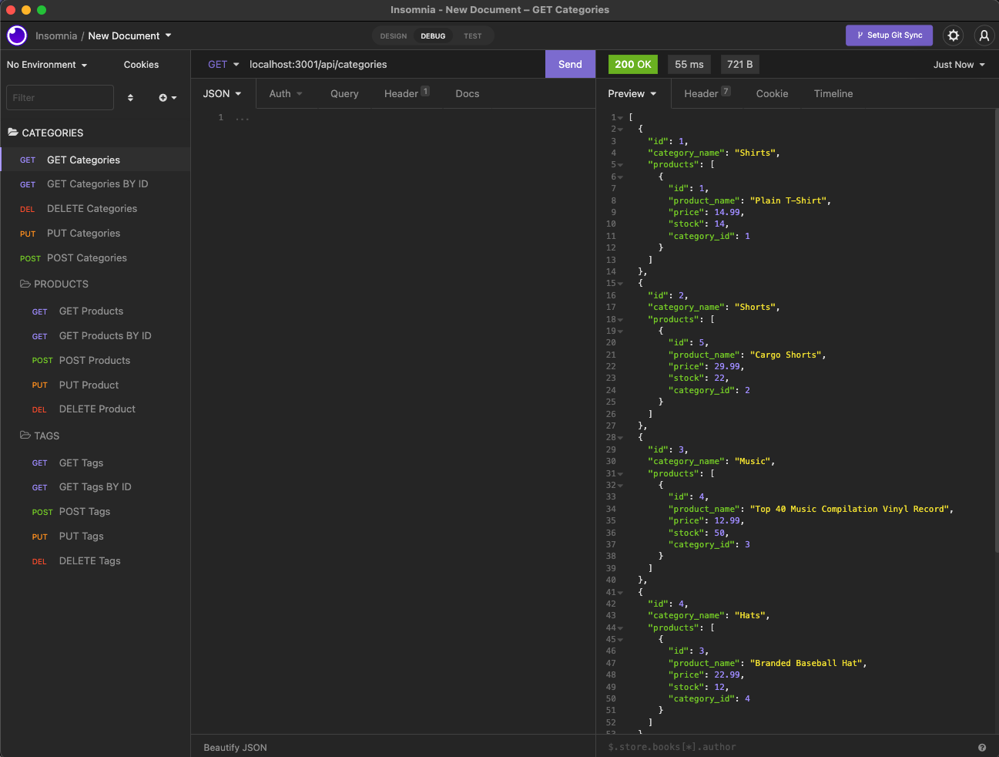

# E-Commerce back-end

## Description

An application that creates, reads, updates, and deletes categories, products or tags from an e-commerce website.

------------------------------

## Table of Contents

1. [Installation](#installation)
2. [Usage Information](#usage)
3. [Contribution Guidelines](#contribution)
4. [Test Instructions](#test)
5. [Questions](#questions)
6. [License](#license)

------------------------------

## Installation 

Command Line Instructions

* Install node dependencies (npm install)
* Create and seed the database (npm run seed)
* Start the application (node server.js)

## Usage Information 

This program's intended purpose is to provide a business owner with the ability to add, update, or delete the necessary items from their website as their inventory or mission changes and evolves.

## Contribution Guidelines 

* Report any bugs to the email below.
* If your code is complicated, use comments.
* Any major changes must be approved by the repo-manager.
* Be respectful.

## Test Instructions 

There are no tests creaeted for this app.

## Screenshot and walkthrough Video

* [Walkthrough Video](https://drive.google.com/file/d/1kZqnS4I3eXeUpGkN6K_HKAtJTjrKQBjC/view)

## Licenses 

* The MIT License

## Questions 

* [GitHub](github.com/3roses) 
* [Email](mailto:cleslie25@gmail.com)
